# Pepper Discord Backlog — Dependency & Batch Map

> **Legend:** 🔴 Not started | 🟡 In progress | 🟢 Done
>
> Arrows mean "must be done before". Batches are groups to implement together.

```mermaid
flowchart TD
    classDef notstarted fill:#ff6b6b,stroke:#c92a2a,color:#fff
    classDef inprogress fill:#ffd43b,stroke:#e67700,color:#333
    classDef done fill:#69db7c,stroke:#2b8a3e,color:#333

    subgraph B1["Batch 1: Core Tools"]
        I10["#10 edit_message"]:::notstarted
        I11["#11 fetch_messages"]:::notstarted
        I14["#14 graceful shutdown"]:::notstarted
    end

    subgraph B2["Batch 2: Message Flow"]
        I9["#9 access control"]:::notstarted
        I12["#12 mention detection"]:::notstarted
        I15["#15 smart chunking"]:::notstarted
    end

    subgraph B3["Batch 3: Rich Interactions"]
        I13["#13 threading + reply-to"]:::notstarted
        I22["#22 progress embeds"]:::notstarted
        I19["#19 slash commands"]:::notstarted
        I16["#16 briefing dashboard"]:::notstarted
    end

    subgraph B4["Batch 4: Power Features"]
        I17["#17 project threads"]:::notstarted
        I18["#18 polls"]:::notstarted
        I26["#26 scheduled events"]:::notstarted
        I21["#21 permission relay"]:::notstarted
    end

    subgraph B5["Batch 5: Attachments"]
        I23["#23 attachment security"]:::notstarted
        I25["#25 download_attachment"]:::notstarted
        I37["#37 attachment system"]:::notstarted
    end

    subgraph B6["Batch 6: Config + Guards"]
        I31["#31 ack reaction"]:::notstarted
        I32["#32 outbound gate"]:::notstarted
        I33["#33 reply-to mode"]:::notstarted
    end

    subgraph B7["Batch 7: Superpowers"]
        I20["#20 forum channel"]:::notstarted
        I24["#24 modal forms"]:::notstarted
        I27["#27 voice TTS"]:::notstarted
        I28["#28 webhook personas"]:::notstarted
        I29["#29 AutoMod"]:::notstarted
        I30["#30 role-based access"]:::notstarted
        I35["#35 Components V2"]:::notstarted
    end

    subgraph BQ["Independent: Quality"]
        I34["#34 MyPy strict"]:::notstarted
        I36["#36 coverage 80pct"]:::notstarted
    end

    %% Dependencies (arrow = "must complete before")
    I10 --> I22
    I10 --> I16
    I11 --> I12
    I13 --> I17
    I13 --> I33
    I9 --> I12
    I9 --> I32
    I9 --> I30
    I22 --> I16
    I19 --> I16
    I15 --> I22
    I23 --> I37
    I25 --> I37
    I19 --> I18
    I19 --> I24
    I35 --> I16
```

## Batch Execution Order

| Batch | Issues | Can parallelize with |
|-------|--------|---------------------|
| **1. Core Tools** | #10, #11, #14 | Quality (BQ) |
| **2. Message Flow** | #9, #12, #15 | Attachments (B5) |
| **3. Rich Interactions** | #13, #22, #19, #16 | — |
| **4. Power Features** | #17, #18, #26, #21 | Config (B6) |
| **5. Attachments** | #23, #25, #37 | Message Flow (B2) |
| **6. Config + Guards** | #31, #32, #33 | Power Features (B4) |
| **7. Superpowers** | #20, #24, #27, #28, #29, #30, #35 | — |
| **Q. Quality** | #34, #36 | Core Tools (B1) |

## Status Tracker

Update this as issues close:

- [ ] #9 — access control
- [ ] #10 — edit_message
- [ ] #11 — fetch_messages
- [ ] #12 — mention detection
- [ ] #13 — threading + reply-to
- [ ] #14 — graceful shutdown
- [ ] #15 — smart chunking
- [ ] #16 — briefing dashboard
- [ ] #17 — project threads
- [ ] #18 — polls
- [ ] #19 — slash commands
- [ ] #20 — forum channel
- [ ] #21 — permission relay
- [ ] #22 — progress embeds
- [ ] #23 — attachment security
- [ ] #24 — modal forms
- [ ] #25 — download_attachment
- [ ] #26 — scheduled events
- [ ] #27 — voice TTS
- [ ] #28 — webhook personas
- [ ] #29 — AutoMod
- [ ] #30 — role-based access
- [ ] #31 — ack reaction
- [ ] #32 — outbound gate
- [ ] #33 — reply-to mode
- [ ] #34 — MyPy strict
- [ ] #35 — Components V2
- [ ] #36 — coverage 80%
- [ ] #37 — attachment system
